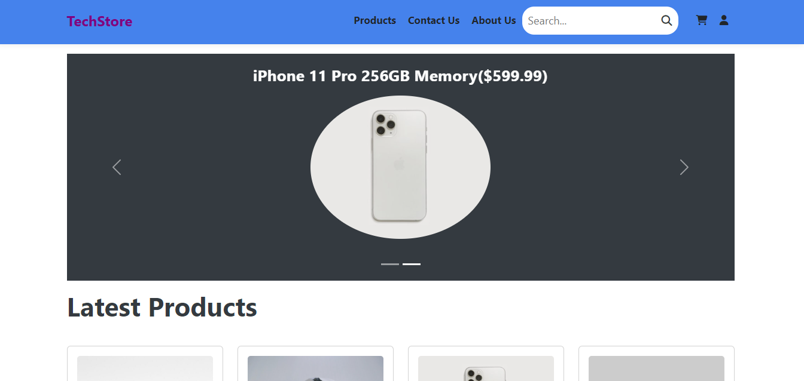

# TechStore



## Introduction

TechStore is a modern e-commerce platform designed for tech enthusiasts to browse, purchase, and review the latest tech gadgets. Built with Django on the backend and React.js on the frontend, TechStore offers a seamless shopping experience with robust features like user authentication, product search, and secure payment processing.
  - [Author 1](https://www.linkedin.com/in/yasmine-ismail2)
  

## Installation

To set up TechStore locally, follow these steps:

1. **Clone the repository:**

    ```bash
    git clone https://github.com/yasmineismail/Ecommerce-Django-Reactjs.git
    cd Ecommerce-Django-Reactjs
    ```

2. **Backend setup (Django):**

    ```bash
    cd Ecommerce-Django-Reactjs
    python3 -m venv venv
    source venv/bin/activate
    pip install -r requirements.txt
    python manage.py migrate
    python manage.py createsuperuser
    python manage.py runserver
    ```

3. **Frontend setup (React):**

    ```bash
    cd frontend
    npm install
    npm start
    ```

## Usage

Once both backend and frontend servers are running, you can access the application at `http://localhost:3000`. Use the admin credentials created during the Django setup to log in to the admin panel at `http://localhost:8000/admin`.

## Contributing

We welcome contributions from the community. To contribute to TechStore, follow these steps:

1. Fork the repository.
2. Create a new branch (`git checkout -b feature/YourFeature`).
3. Commit your changes (`git commit -m 'Add some feature'`).
4. Push to the branch (`git push origin feature/YourFeature`).
5. Create a new Pull Request.

## Features
- Full featured shopping cart
- Product reviews and ratings
- Top products carousel
- Product pagination
- Product search feature
- User profile with orders
- Admin product management
- Admin user management
- Admin Order details page
- Mark orders as delivered option
- Checkout process (shipping, payment method, etc)
- PayPal / credit card integration

  
